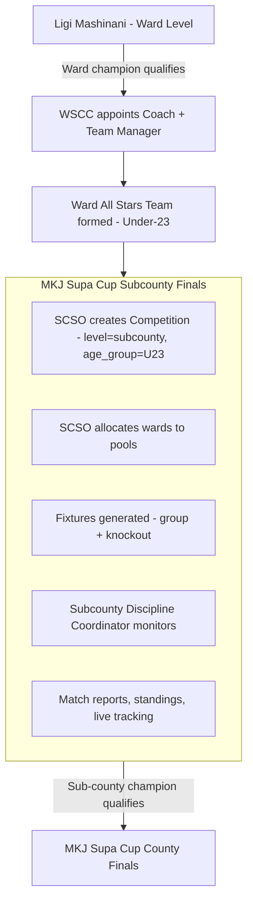
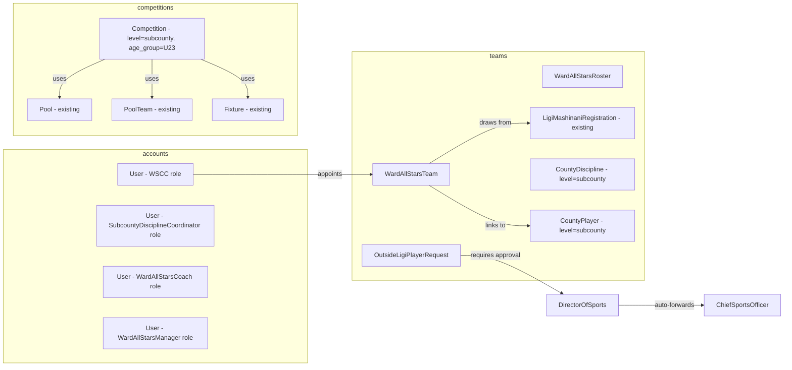
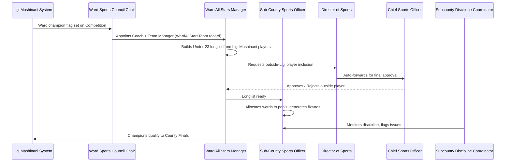

# Design Document: MKJ Supa Cup Subcounty Finals

## Overview

The MKJ Supa Cup Subcounty Finals is a new competition tier inserted between Ligi Mashinani (ward level) and the MKJ Supa Cup County Finals. The winning team from each ward Ligi Mashinani competition qualifies their ward, and the WSCC (Ward Sports Council Chairperson) then appoints a Coach and Team Manager to assemble a **Ward All Stars Team** — a Under-23 squad drawn primarily from existing Ligi Mashinani registered players. The Sub-County Sports Officer (SCSO) manages pool allocation and competition flow using the same engine that powers the County Finals.

This feature extends the existing `ligi-mashinani-subcounty-system` implementation. No new Django apps are created; all additions are layered onto `competitions`, `teams`, `accounts`, and `mkj_cms/web_views.py`.

---

## Architecture

### High-Level Competition Pipeline



### System Component Map



---

## Role Interactions

### New Roles

| Role | UserRole value | Scope | Responsibilities |
|------|----------------|-------|-----------------|
| **Subcounty Discipline Coordinator** | `subcounty_discipline_coordinator` | Per discipline, per sub-county | Monitors a single discipline's Subcounty Finals; read-only on fixtures/standings; submits incident reports |
| **Ward All Stars Coach** | Appointment record only — not a separate UserRole | Per ward, per discipline | Co-manages ward all stars squad with TM; listed on WardAllStarsTeam record |
| **Ward All Stars Manager** | Uses existing `team_manager` role | Per ward, per discipline | Forms Under-23 longlist, submits squad for each fixture |

> **Note:** WSCC appoints Coach and TM via appointment records on `WardAllStarsTeam`. Coach and TM are persons (with a `User` account or a name record). The Ward All Stars Manager uses the existing `TEAM_MANAGER` role — they receive a portal account via the same credential-email flow used in Ligi Mashinani.

### Role Interaction Sequence



---

## Data Model Changes

### New Models

#### 1. `WardAllStarsTeam` (teams/models.py)

Links a qualifying ward to its appointed officials and Under-23 squad for a specific Subcounty Finals competition.

```python
class WardAllStarsTeam(models.Model):
    competition  = ForeignKey(Competition, on_delete=CASCADE, related_name="ward_all_stars_teams")
    ward         = CharField(max_length=100)
    sub_county   = CharField(max_length=100)
    sport_type   = CharField(max_length=30, choices=SportType.choices)
    official_name = CharField(max_length=200,
                              help_text="e.g. 'Mavindini Ward All Stars'")

    # Appointed officials
    appointed_coach_user   = ForeignKey(User, null=True, blank=True,
                                         related_name="coached_ward_allstars")
    appointed_coach_name   = CharField(max_length=200, blank=True)
    appointed_tm_user      = ForeignKey(User, null=True, blank=True,
                                         related_name="managed_ward_allstars")
    appointed_by_wscc      = ForeignKey(User, null=True, blank=True,
                                         related_name="wscc_allstars_appointments")
    appointed_at           = DateTimeField(null=True, blank=True)

    # Linked ward discipline (source of eligible players)
    source_discipline      = ForeignKey(CountyDiscipline, null=True, blank=True,
                                         limit_choices_to={"level": "ward"})

    # Linked subcounty discipline (where allstars players are stored)
    subcounty_discipline   = ForeignKey(CountyDiscipline, null=True, blank=True,
                                         related_name="ward_allstars_sources",
                                         limit_choices_to={"level": "subcounty"})

    # Status flags
    is_active     = BooleanField(default=True)
    qualified_from_ligi = BooleanField(default=False,
                                        help_text="True when ward champion flag is confirmed")
    created_at    = DateTimeField(auto_now_add=True)
    updated_at    = DateTimeField(auto_now=True)

    class Meta:
        unique_together = ["competition", "ward", "sport_type"]
```

#### 2. `OutsideLigiPlayerRequest` (teams/models.py)

Tracks requests to include players not registered in Ligi Mashinani for a ward all-stars team.

```python
class OutsideLigiRequestStatus(models.TextChoices):
    PENDING_DIRECTOR   = "pending_director",  "Pending Director of Sports"
    FORWARDED_CSO      = "forwarded_cso",     "Forwarded to Chief Sports Officer"
    CSO_APPROVED       = "cso_approved",      "Approved by CSO"
    CSO_REJECTED       = "cso_rejected",      "Rejected by CSO"
    DIRECTOR_REJECTED  = "director_rejected", "Rejected by Director of Sports"

class OutsideLigiPlayerRequest(models.Model):
    ward_allstars   = ForeignKey(WardAllStarsTeam, on_delete=CASCADE,
                                  related_name="outside_ligi_requests")
    player_name     = CharField(max_length=200)
    national_id     = CharField(max_length=20, validators=[national_id_validator])
    date_of_birth   = DateField()
    justification   = TextField(help_text="Why this player is needed")
    supporting_doc  = FileField(upload_to="outside_ligi_requests/", null=True, blank=True)

    status          = CharField(max_length=25,
                                 choices=OutsideLigiRequestStatus.choices,
                                 default=OutsideLigiRequestStatus.PENDING_DIRECTOR)
    requested_by    = ForeignKey(User, null=True, related_name="outside_ligi_requests_made")
    director_reviewed_by  = ForeignKey(User, null=True, blank=True,
                                        related_name="director_olp_reviews")
    director_reviewed_at  = DateTimeField(null=True, blank=True)
    director_notes        = TextField(blank=True, default="")
    cso_reviewed_by       = ForeignKey(User, null=True, blank=True,
                                        related_name="cso_olp_reviews")
    cso_reviewed_at       = DateTimeField(null=True, blank=True)
    cso_notes             = TextField(blank=True, default="")
    created_at      = DateTimeField(auto_now_add=True)
    updated_at      = DateTimeField(auto_now=True)

    class Meta:
        unique_together = ["ward_allstars", "national_id"]
```

#### 3. `SubcountyDisciplineCoordinator` appointment record (teams/models.py)

Tracks the per-discipline, per-sub-county Subcounty Discipline Coordinator appointment without introducing a new User role (it is an existing `coordinator` role user with a scoped assignment).

```python
class SubcountyDisciplineCoordinator(models.Model):
    """
    Links a Coordinator-role user to a specific discipline + sub-county
    for the Subcounty Finals.  One SDC per discipline per sub-county.
    """
    user        = ForeignKey(User, on_delete=CASCADE,
                              limit_choices_to={"role": "coordinator"},
                              related_name="sdc_assignments")
    sub_county  = CharField(max_length=100)
    sport_type  = CharField(max_length=30, choices=SportType.choices)
    season      = CharField(max_length=10, default="2025")
    appointed_by = ForeignKey(User, null=True, blank=True,
                               on_delete=SET_NULL,
                               related_name="sdc_appointments_made")
    appointed_at = DateTimeField(auto_now_add=True)
    is_active    = BooleanField(default=True)

    class Meta:
        unique_together = ["sub_county", "sport_type", "season"]
```

### Existing Model Extensions

#### `Competition` model — no new fields needed

The existing `Competition` model already has all required fields:
- `level = "subcounty"` (from `CompetitionLevel.SUBCOUNTY`)
- `age_group = "U23"` (from `AgeGroup.U23`)
- `sub_county` field
- `sport_type`, `format_type`, `status`, `pools`, `fixtures`

SCSO creates a `Competition` with `level=subcounty, age_group=U23` and the sub-county auto-populated. The existing pools/fixtures/standings engine handles everything else.

#### `CountyDiscipline` model — no new fields needed

Each `WardAllStarsTeam` links to a `CountyDiscipline` at `level=subcounty`. The existing `CountyPlayer` records at `level=subcounty` are the Under-23 longlist for that discipline.

#### `User` model — `subcounty_discipline_coordinator` role

Add `SUBCOUNTY_DISCIPLINE_COORDINATOR = "subcounty_discipline_coordinator", "Subcounty Discipline Coordinator"` to `UserRole`. Add `is_subcounty_discipline_coordinator` property.

#### `CountyPlayer` model — add `allstars_team` optional FK

```python
# In CountyPlayer:
allstars_team = ForeignKey(
    "WardAllStarsTeam", null=True, blank=True,
    on_delete=SET_NULL,
    related_name="allstars_players",
    help_text="If set, this player was added to the ward all-stars team via the Subcounty Finals pipeline"
)
is_outside_ligi = BooleanField(
    default=False,
    help_text="True when player was not in Ligi Mashinani and added via OutsideLigiPlayerRequest"
)
outside_ligi_request = ForeignKey(
    "OutsideLigiPlayerRequest", null=True, blank=True,
    on_delete=SET_NULL,
    related_name="approved_players"
)
```

#### Ward Champion Flag on `Competition` (ward level)

The existing ward `Competition` gains no new fields. Instead, when SCSO marks a ward team as the champion/qualifier, `Team.qualified_to_county` is repurposed: `qualified_to_subcounty_finals` is added as a new BooleanField to `Team` alongside the existing `qualified_to_county`.

```python
# In Team model (teams/models.py):
qualified_to_subcounty_finals = BooleanField(
    default=False,
    help_text="True when ward team qualifies to Subcounty Finals",
)
qualifying_subcounty_competition = ForeignKey(
    "competitions.Competition",
    null=True, blank=True,
    on_delete=SET_NULL,
    related_name="ward_qualified_teams",
    help_text="Subcounty Finals competition this ward team qualified for",
)
```

---

## Competition Flow Diagram

```mermaid
sequenceDiagram
    participant WSCC as WSCC
    participant TM as Ward All Stars TM
    participant SCSO as SCSO
    participant DS as Director of Sports
    participant CSO as Chief Sports Officer
    participant SYS as System

    Note over WSCC,SYS: Phase 1 - Ward Qualification & Team Setup
    WSCC->>SYS: Ward champion confirmed in Ligi Mashinani
    SYS->>SCSO: Notifies SCSO that ward qualifiers are ready
    SCSO->>SYS: Creates Subcounty Finals Competition (level=subcounty, age_group=U23)
    WSCC->>SYS: Creates WardAllStarsTeam, appoints Coach + TM
    SYS->>TM: Portal account created / credentials emailed

    Note over TM,SYS: Phase 2 - Under-23 Longlist Formation
    TM->>SYS: Opens ward all-stars longlist
    SYS->>TM: Shows all Ligi Mashinani players from ward (eligible if age ≤ 23)
    TM->>SYS: Selects players → added as CountyPlayer at level=subcounty
    TM->>DS: Requests outside-Ligi player inclusion
    DS->>SYS: Reviews; if forward-worthy → auto-forwards to CSO
    CSO->>SYS: Approves or rejects
    SYS->>TM: Notifies result

    Note over SCSO,SYS: Phase 3 - Pool Allocation & Fixtures
    SCSO->>SYS: Allocates WardAllStarsTeams to pools
    SYS->>SYS: Generates fixtures (group stage + knockout)
    SYS->>TM: Fixture schedule notification

    Note over TM,SYS: Phase 4 - Match Day
    TM->>SYS: Submits match-day squad (from verified Under-23 longlist)
    SYS->>SYS: Validates age ≤ 23 for ALL squad members
    SCSO->>SYS: Records results, standings update automatically

    Note over SCSO,SYS: Phase 5 - Qualification
    SCSO->>SYS: Marks sub-county champions (qualified_to_county=True)
    SYS->>SYS: Links Team to county-level Competition
```

---

## Age Eligibility Check Algorithm

The Subcounty Finals is **strictly Under-23** (age 18–23 inclusive on competition date). All age checks use the player's verified `date_of_birth` from the `CountyPlayer` record.

```python
from datetime import date
from django.core.exceptions import ValidationError

# Constants
SUBCOUNTY_FINALS_MIN_AGE = 18
SUBCOUNTY_FINALS_MAX_AGE = 23

def check_subcounty_finals_age_eligibility(
    date_of_birth: date,
    competition_start_date: date,
) -> tuple[bool, str]:
    """
    Preconditions:
        - date_of_birth is a valid date in the past
        - competition_start_date is a valid future or current date

    Postconditions:
        - Returns (True, "") if 18 <= age_on_competition_day <= 23
        - Returns (False, reason_str) if age is outside bracket
        - Age is calculated on competition_start_date (not today)

    Loop Invariants: N/A (no loops)
    """
    if date_of_birth is None:
        return False, "Date of birth is required for Subcounty Finals."

    # Age on first day of competition
    ref = competition_start_date
    age = (
        ref.year - date_of_birth.year
        - ((ref.month, ref.day) < (date_of_birth.month, date_of_birth.day))
    )

    if age < SUBCOUNTY_FINALS_MIN_AGE:
        return False, f"Player is {age} years old — minimum age is {SUBCOUNTY_FINALS_MIN_AGE} for Subcounty Finals."
    if age > SUBCOUNTY_FINALS_MAX_AGE:
        return False, f"Player is {age} years old — maximum age is {SUBCOUNTY_FINALS_MAX_AGE} for Subcounty Finals (Under-23)."

    return True, ""


def validate_ward_allstars_squad_age(squad_players, competition):
    """
    Called before any squad submission is accepted.
    Rejects the entire submission if any player is outside 18-23.

    Preconditions:
        - squad_players: iterable of CountyPlayer objects at level=subcounty
        - competition: Competition with age_group=U23 and a valid start_date

    Postconditions:
        - Raises ValidationError listing all ineligible players if any fail
        - Returns None silently if all players pass
    """
    errors = []
    for player in squad_players:
        eligible, reason = check_subcounty_finals_age_eligibility(
            player.date_of_birth, competition.start_date
        )
        if not eligible:
            errors.append(f"{player.first_name} {player.last_name}: {reason}")

    if errors:
        raise ValidationError(
            "The following players do not meet the Under-23 age requirement:\n"
            + "\n".join(errors)
        )
```

---

## Outside-Ligi Player Request Flow

```python
from django.db import transaction
from django.utils import timezone
from accounts.models import User, UserRole

def submit_outside_ligi_player_request(
    ward_allstars_team,
    player_name,
    national_id,
    date_of_birth,
    justification,
    requested_by_user,
    supporting_doc=None,
):
    """
    Submit a request to add a player not in Ligi Mashinani to the ward all-stars.

    Workflow:
        1. Validate: no duplicate national_id in this ward allstars team
        2. Create OutsideLigiPlayerRequest with status=PENDING_DIRECTOR
        3. Email notification to Director of Sports

    Preconditions:
        - ward_allstars_team: WardAllStarsTeam instance
        - requested_by_user: the Ward All Stars Manager (team_manager role)
        - national_id: not already in ward allstars team
        - date_of_birth: results in age 18-23 on competition date

    Postconditions:
        - OutsideLigiPlayerRequest record created with PENDING_DIRECTOR
        - Email sent to Director of Sports
        - Returns the created request object
    """
    if OutsideLigiPlayerRequest.objects.filter(
        ward_allstars=ward_allstars_team,
        national_id=national_id,
    ).exists():
        raise ValidationError(
            f"A player with national ID {national_id} is already in the request queue."
        )

    # Validate age eligibility
    eligible, reason = check_subcounty_finals_age_eligibility(
        date_of_birth, ward_allstars_team.competition.start_date
    )
    if not eligible:
        raise ValidationError(reason)

    request_obj = OutsideLigiPlayerRequest.objects.create(
        ward_allstars=ward_allstars_team,
        player_name=player_name,
        national_id=national_id,
        date_of_birth=date_of_birth,
        justification=justification,
        supporting_doc=supporting_doc,
        status=OutsideLigiRequestStatus.PENDING_DIRECTOR,
        requested_by=requested_by_user,
    )

    # Notify Director of Sports
    send_director_outside_ligi_notification(request_obj)

    return request_obj


@transaction.atomic
def director_review_outside_ligi_request(request_obj, director_user, action, notes=""):
    """
    Director of Sports reviews and either approves → auto-forwards to CSO,
    or rejects the request outright.

    Preconditions:
        - request_obj.status == PENDING_DIRECTOR
        - director_user.role == DIRECTOR_SPORTS or ADMIN
        - action: "approve" or "reject"

    Postconditions:
        - If action=="approve":
            - request_obj.status = FORWARDED_CSO
            - Email sent to Chief Sports Officer
        - If action=="reject":
            - request_obj.status = DIRECTOR_REJECTED
            - Email sent to Ward All Stars Manager (rejection)
        - director_reviewed_by, director_reviewed_at, director_notes are set
    """
    if request_obj.status != OutsideLigiRequestStatus.PENDING_DIRECTOR:
        raise ValidationError("Request is no longer pending Director review.")

    request_obj.director_reviewed_by = director_user
    request_obj.director_reviewed_at = timezone.now()
    request_obj.director_notes = notes

    if action == "approve":
        request_obj.status = OutsideLigiRequestStatus.FORWARDED_CSO
        request_obj.save()
        send_cso_outside_ligi_notification(request_obj)
    elif action == "reject":
        request_obj.status = OutsideLigiRequestStatus.DIRECTOR_REJECTED
        request_obj.save()
        send_tm_rejection_notification(request_obj)
    else:
        raise ValueError(f"Invalid action: {action}")


@transaction.atomic
def cso_final_review_outside_ligi_request(request_obj, cso_user, action, notes=""):
    """
    Chief Sports Officer final approval or rejection.

    Preconditions:
        - request_obj.status == FORWARDED_CSO
        - cso_user.role == CHIEF_SPORTS_OFFICER or ADMIN
        - action: "approve" or "reject"

    Postconditions:
        - If action=="approve":
            - request_obj.status = CSO_APPROVED
            - A CountyPlayer record is created at level=subcounty
            - Player is linked to ward_allstars.subcounty_discipline
            - Player.is_outside_ligi = True
            - Player.outside_ligi_request = request_obj
            - Email sent to Ward All Stars Manager (approval)
        - If action=="reject":
            - request_obj.status = CSO_REJECTED
            - Email sent to Ward All Stars Manager (rejection)
        - cso_reviewed_by, cso_reviewed_at, cso_notes are set
    """
    if request_obj.status != OutsideLigiRequestStatus.FORWARDED_CSO:
        raise ValidationError("Request must be forwarded by Director first.")

    request_obj.cso_reviewed_by = cso_user
    request_obj.cso_reviewed_at = timezone.now()
    request_obj.cso_notes = notes

    if action == "approve":
        request_obj.status = OutsideLigiRequestStatus.CSO_APPROVED
        request_obj.save()

        # Create CountyPlayer record
        player = CountyPlayer.objects.create(
            discipline=request_obj.ward_allstars.subcounty_discipline,
            first_name=request_obj.player_name.split()[0],
            last_name=" ".join(request_obj.player_name.split()[1:]),
            date_of_birth=request_obj.date_of_birth,
            national_id_number=request_obj.national_id,
            is_outside_ligi=True,
            outside_ligi_request=request_obj,
            allstars_team=request_obj.ward_allstars,
            verification_status="pending",
        )
        send_tm_approval_notification(request_obj, player)
    elif action == "reject":
        request_obj.status = OutsideLigiRequestStatus.CSO_REJECTED
        request_obj.save()
        send_tm_rejection_notification(request_obj)
    else:
        raise ValueError(f"Invalid action: {action}")
```

---

## Components and Interfaces

### Component 1: WSCC Ward All Stars Management Portal

**Purpose:** WSCC appoints Coach and TM, confirms ward qualification, and creates the official `WardAllStarsTeam` record.

**Interface (view functions in `mkj_cms/web_views.py`):**

```python
@login_required
@role_required("ward_sports_council_chair", "admin")
def wscc_allstars_dashboard_view(request):
    """
    GET /ligi/wscc/allstars/
    Shows all WardAllStarsTeam records for WSCC's sub-county.
    Context: ward_allstars_teams, pending_appointments
    """

@login_required
@role_required("ward_sports_council_chair", "admin")
def wscc_create_allstars_team_view(request, competition_pk):
    """
    GET/POST /ligi/wscc/allstars/<int:competition_pk>/create/
    Creates WardAllStarsTeam for the ward in this Subcounty Finals competition.
    POST: {coach_name, coach_user_pk, tm_user_pk, official_name}
    On success: creates TM portal account if needed, sends credentials email
    """

@login_required
@role_required("ward_sports_council_chair", "admin")
def wscc_appoint_officials_view(request, allstars_pk):
    """
    GET/POST /ligi/wscc/allstars/<int:allstars_pk>/appoint/
    Appoints or replaces Coach / Team Manager.
    Enforces: only one active Coach and one active TM per WardAllStarsTeam.
    On TM replacement: old TM portal access revoked (is_active=False).
    """

@login_required
@role_required("ward_sports_council_chair", "admin")
def wscc_revoke_official_view(request, allstars_pk):
    """
    POST /ligi/wscc/allstars/<int:allstars_pk>/revoke/
    Revokes Coach or TM appointment.
    POST: {role: "coach"|"tm"}
    """
```

**Responsibilities:**
- Confirm ward qualification → sets `team.qualified_to_subcounty_finals = True`
- Create `WardAllStarsTeam` linked to the Subcounty Finals `Competition`
- Appoint, replace, or revoke Coach and TM
- Ensure only one active TM per `WardAllStarsTeam` (same ward/sport/competition)

### Component 2: Ward All Stars Manager Portal (Subcounty Finals)

**Purpose:** TM builds the Under-23 longlist by selecting from Ligi Mashinani players and submitting requests for outside-Ligi additions.

**Interface:**

```python
@login_required
@role_required("team_manager")
def allstars_tm_dashboard_view(request):
    """
    GET /ligi/allstars/dashboard/
    Shows TM's WardAllStarsTeam, current longlist summary, fixture list.
    Requires: request.user linked to a WardAllStarsTeam as appointed_tm_user
    """

@login_required
@role_required("team_manager")
def allstars_tm_longlist_view(request):
    """
    GET /ligi/allstars/longlist/
    Lists all CountyPlayer records linked to the TM's WardAllStarsTeam
    at level=subcounty. Displays:
      - Ligi Mashinani players added (source_ward_player set)
      - Outside-Ligi players (is_outside_ligi=True)
      - Age eligibility indicator for each player
    """

@login_required
@role_required("team_manager")
def allstars_tm_add_ligi_player_view(request):
    """
    GET/POST /ligi/allstars/longlist/add-ligi-player/
    Presents all Ligi Mashinani players from the same ward + sport_type
    who are age-eligible (18-23) and not already added.
    POST: {county_player_pk} → calls promote_ward_to_allstars(player, allstars_team)
    """

@login_required
@role_required("team_manager")
def allstars_tm_request_outside_player_view(request):
    """
    GET/POST /ligi/allstars/longlist/request-outside-player/
    POST: {player_name, national_id, date_of_birth, justification, supporting_doc}
    Calls: submit_outside_ligi_player_request()
    """

@login_required
@role_required("team_manager")
def allstars_tm_outside_requests_view(request):
    """
    GET /ligi/allstars/longlist/outside-requests/
    Lists all OutsideLigiPlayerRequest for TM's WardAllStarsTeam.
    Shows status of each (pending director / forwarded CSO / approved / rejected).
    """

@login_required
@role_required("team_manager")
def allstars_tm_fixture_squad_view(request, fixture_pk):
    """
    GET/POST /ligi/allstars/fixtures/<int:fixture_pk>/squad/
    Match-day squad selection from approved + verified allstars players.
    Enforces: SQUAD_LIMITS per sport_type, age 18-23 for every player.
    Reuses existing SquadSubmission / SquadPlayer models.
    """
```

### Component 3: Director of Sports — Outside-Ligi Review

**Purpose:** DS reviews incoming requests for outside-Ligi players and approves (forwarding to CSO) or rejects.

```python
@login_required
@role_required("director_sports", "admin")
def director_outside_ligi_requests_view(request):
    """
    GET /portal/director/outside-ligi-requests/
    Lists OutsideLigiPlayerRequest with status=PENDING_DIRECTOR.
    """

@login_required
@role_required("director_sports", "admin")
def director_outside_ligi_review_view(request, request_pk):
    """
    GET/POST /portal/director/outside-ligi-requests/<int:request_pk>/
    POST: {action: "approve"|"reject", notes}
    Calls: director_review_outside_ligi_request()
    """
```

### Component 4: Chief Sports Officer — Final Outside-Ligi Approval

```python
@login_required
@role_required("chief_sports_officer", "admin")
def cso_outside_ligi_requests_view(request):
    """
    GET /portal/cso/outside-ligi-requests/
    Lists OutsideLigiPlayerRequest with status=FORWARDED_CSO.
    """

@login_required
@role_required("chief_sports_officer", "admin")
def cso_outside_ligi_review_view(request, request_pk):
    """
    GET/POST /portal/cso/outside-ligi-requests/<int:request_pk>/
    POST: {action: "approve"|"reject", notes}
    Calls: cso_final_review_outside_ligi_request()
    """
```

### Component 5: SCSO — Subcounty Finals Competition Management

**Reuse:** All views from the existing `sc_competitions_view`, `sc_manage_pools_view`, `sc_generate_fixtures_view`, `sc_live_match_view`, `sc_edit_standings_view`, `sc_qualify_teams_view` are reused without modification. The SCSO simply creates a Competition with `level=subcounty, age_group=U23`.

**New additions:**

```python
@login_required
@role_required("subcounty_sports_officer", "admin")
def sc_allstars_overview_view(request, competition_pk):
    """
    GET /portal/subcounty/competitions/<int:competition_pk>/allstars/
    Overview of all WardAllStarsTeam records in this competition.
    Shows: ward, appointment status, longlist size, squad-ready flag.
    """

@login_required
@role_required("subcounty_sports_officer", "admin")
def sc_qualify_ward_champion_view(request, competition_pk):
    """
    GET/POST /portal/subcounty/competitions/<int:competition_pk>/qualify-ward/
    Lists qualifying ward teams from Ligi Mashinani within SCSO's sub-county.
    POST: marks Team.qualified_to_subcounty_finals = True, creates WardAllStarsTeam stub.
    """
```

### Component 6: Subcounty Discipline Coordinator Portal

```python
@login_required
@role_required("coordinator", "admin")
def sdc_dashboard_view(request):
    """
    GET /portal/sdc/
    Shows competitions for coordinator's assigned sub_county + sport_type.
    Read-only access to fixtures, standings, match reports.
    """

@login_required
@role_required("coordinator", "admin")
def sdc_competition_view(request, competition_pk):
    """
    GET /portal/sdc/competitions/<int:competition_pk>/
    Detailed competition view: pools, fixtures, standings — all read-only.
    """

@login_required
@role_required("coordinator", "admin")
def sdc_incident_report_view(request, fixture_pk):
    """
    GET/POST /portal/sdc/fixtures/<int:fixture_pk>/incident/
    Coordinator submits an incident report for a fixture in their discipline.
    POST: {incident_type, description}
    Stored as MatchReport with source="sdc_incident".
    """
```
