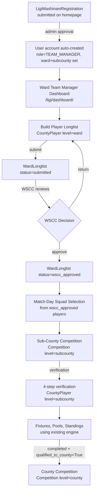

# Design Document

## Ligi Mashinani → Sub-County MKJ Finals → County MKJ Supa Cup Finals

---

## Overview

This feature extends the MKJ SUPA CUP Django application to support a three-level grassroots competition pipeline for Makueni County:

1. **Level 1 — Ligi Mashinani (Ward Level):** Ward teams register and manage player longlists, with Ward Sports Council Chairpersons (WSCCs) approving those longlists before match-day squads can be selected.
2. **Level 2 — Sub-County MKJ Finals:** Sub-County Sports Officers manage fixtures, pools, standings, and player verification using the same competition engine as county finals, scoped to one of Makueni's six sub-counties.
3. **Level 3 — MKJ Supa Cup County Finals:** Existing county pipeline, seeded by qualifiers from sub-county finals.

The design philosophy is **additive, not parallel**: a `level` field (`ward` / `subcounty` / `county`) is added to `Competition`, `CountyRegistration`, and `CountyDiscipline` to scope all related objects without duplicating model families. All new views live in `mkj_cms/web_views.py` following existing patterns. No new Django apps are introduced.

---

## Architecture

### Design Principles

- **Single model family:** `Competition`, `CountyRegistration`, `CountyDiscipline`, `CountyPlayer`, `Team`, `Fixture`, `Pool`, `PoolTeam` are reused at all three levels via the new `level` field.
- **Scope by level at the queryset boundary:** Every view filters by `level` before rendering. Helper functions `_discipline_queryset_for_user()` and `_competition_queryset_for_user()` are extended to respect `level`.
- **Existing verification engine:** The 4-step verification workflow in `teams/verification_views.py` is applied unchanged at subcounty level; new URL routes scope it to `/subcounty/`.
- **URL namespacing:** Ward-level portals live under `/ligi/`, sub-county portals under `/subcounty/`. The existing `/portal/subcounty-officer/` prefix is retained for the upgraded SCSO portal.
- **No new apps:** All new view functions are added to `mkj_cms/web_views.py` with clear section comments. New model classes (`WardLonglist`) are added to `teams/models.py`.

### High-Level Flow



---

## Components and Interfaces

### 1. Model Layer Changes

#### 1.1 `accounts/models.py` — UserRole Extension

Add one new choice to the `UserRole` enum:

```python
WARD_SPORTS_COUNCIL_CHAIR = "ward_sports_council_chair", "Ward Sports Council Chair"
```

Add a `ward` field to the `User` model (already has `sub_county`):

```python
ward = models.CharField(
    max_length=100, blank=True, default="",
    help_text="Ward assignment (for ward-level roles such as WSCC and ward team managers)",
)
```

Add a `is_ward_sports_council_chair` property following the existing role helper pattern.

#### 1.2 `competitions/models.py` — Competition Level

Add `CompetitionLevel` TextChoices and `level` field to `Competition`:

```python
class CompetitionLevel(models.TextChoices):
    WARD      = "ward",      "Ward (Ligi Mashinani)"
    SUBCOUNTY = "subcounty", "Sub-County MKJ Finals"
    COUNTY    = "county",    "County MKJ Supa Cup"

# On Competition model:
level = models.CharField(
    max_length=20, choices=CompetitionLevel.choices,
    default=CompetitionLevel.COUNTY,
    help_text="Competition level in the pipeline",
)
sub_county = models.CharField(
    max_length=100, blank=True, default="",
    help_text="Makueni sub-county for subcounty/ward competitions",
)
ward = models.CharField(
    max_length=100, blank=True, default="",
    help_text="Ward for ward-level competitions",
)
```

Override `clean()` to enforce:
- `level=subcounty` → `sub_county` must not be blank
- `level=ward` → both `sub_county` and `ward` must not be blank
- `level=county` → no additional requirements (preserves existing behaviour)

#### 1.3 `teams/models.py` — Level Fields

Add `level` field with `CompetitionLevel` choices to `CountyRegistration` and `CountyDiscipline`, both defaulting to `county`.

Update `CountyDiscipline.unique_together` to include `level` and `ward`:

```python
class Meta:
    unique_together = ["registration", "sport_type", "sub_county", "level", "ward"]
```

Add `ward` field to `CountyDiscipline`:

```python
ward = models.CharField(max_length=100, blank=True, default="",
    help_text="Ward for ward-level disciplines")
```

#### 1.4 `teams/models.py` — WardLonglist Model (new)

```python
class WardLonglistStatus(models.TextChoices):
    DRAFT         = "draft",          "Draft"
    SUBMITTED     = "submitted",      "Submitted"
    WSCC_APPROVED = "wscc_approved",  "WSCC Approved"
    RETURNED      = "returned",       "Returned for Correction"

class WardLonglist(models.Model):
    """
    Tracks the submission lifecycle of a ward team's player longlist.
    One WardLonglist per CountyDiscipline at level=ward.
    Players are the related CountyPlayer objects on that discipline.
    """
    discipline = models.OneToOneField(
        CountyDiscipline, on_delete=models.CASCADE,
        related_name="longlist",
        limit_choices_to={"level": "ward"},
    )
    status = models.CharField(
        max_length=20, choices=WardLonglistStatus.choices,
        default=WardLonglistStatus.DRAFT,
    )
    submitted_at = models.DateTimeField(null=True, blank=True)
    reviewed_by  = models.ForeignKey(
        settings.AUTH_USER_MODEL, on_delete=models.SET_NULL,
        null=True, blank=True, related_name="reviewed_longlists",
    )
    reviewed_at  = models.DateTimeField(null=True, blank=True)
    return_reason = models.TextField(blank=True, default="")
    created_at   = models.DateTimeField(auto_now_add=True)
    updated_at   = models.DateTimeField(auto_now=True)

    class Meta:
        ordering = ["-submitted_at"]

    def __str__(self):
        return f"Longlist: {self.discipline} [{self.get_status_display()}]"
```

#### 1.5 `teams/models.py` — Team Qualification Flag

Add to the `Team` model:

```python
qualified_to_county = models.BooleanField(
    default=False,
    help_text="Team has been designated as a qualifier to the county competition",
)
qualifying_county_competition = models.ForeignKey(
    "competitions.Competition", on_delete=models.SET_NULL,
    null=True, blank=True,
    related_name="qualified_teams",
    help_text="County competition this team qualifies to",
)
```

### 2. Signal / Approval Handler

The existing admin action for approving `LigiMashinaniRegistration` records is extended to:

1. Open a database transaction.
2. Create the `User` with `role=TEAM_MANAGER`, `must_change_password=True`, `sub_county` and `ward` from the registration.
3. Find or create the `CountyRegistration` for Makueni county (level=ward).
4. Create the `CountyDiscipline` at `level=ward` with the registration's `sub_county` and `ward` if it does not already exist.
5. Create the `Team` record (`status=registered`) linked to the discipline.
6. Create a `WardLonglist` in `draft` status for that discipline.
7. Send credentials email.
8. Set `LigiMashinaniRegistration.account_created = True`.

On any exception: rollback the transaction, set status back to `pending`, log to `ActivityLog`, and surface an admin error message.

This logic lives in `teams/admin.py` (existing `LigiMashinaniRegistrationAdmin`) as a custom `approve_registrations` admin action, following the existing signal pattern in `accounts/signals.py`.

### 3. View Layer

#### 3.1 Ward Team Manager Portal (`/ligi/`)

All views gated with `@role_required('team_manager')` plus a guard that redirects if the user has no linked `WardLonglist`.

| URL | View Function | Description |
|-----|--------------|-------------|
| `/ligi/dashboard/` | `ward_tm_dashboard_view` | Summary of ward, sub-county, discipline, longlist status |
| `/ligi/longlist/` | `ward_tm_longlist_view` | List players in the ward discipline |
| `/ligi/longlist/add-player/` | `ward_tm_add_player_view` | Add a player (enforces required fields, duplicate ID check) |
| `/ligi/longlist/<int:player_pk>/edit/` | `ward_tm_edit_player_view` | Edit player (blocked if longlist wscc_approved) |
| `/ligi/longlist/<int:player_pk>/delete/` | `ward_tm_delete_player_view` | Delete player (blocked if wscc_approved) |
| `/ligi/longlist/submit/` | `ward_tm_submit_longlist_view` | Submit longlist for WSCC review |
| `/ligi/fixtures/` | `ward_tm_fixtures_view` | Upcoming ward fixtures |
| `/ligi/fixtures/<int:fixture_pk>/squad/` | `ward_tm_ward_squad_view` | Select match-day squad from wscc_approved players |

#### 3.2 Ward Sports Council Chair Portal (`/ligi/wscc/`)

All views gated with `@role_required('ward_sports_council_chair', 'admin')`. Querysets scoped to `sub_county = request.user.sub_county`.

| URL | View Function | Description |
|-----|--------------|-------------|
| `/ligi/wscc/dashboard/` | `wscc_dashboard_view` | Dashboard: pending/submitted longlists in the WSCC's sub-county |
| `/ligi/wscc/longlists/` | `wscc_longlists_view` | List all longlists for the sub-county's wards |
| `/ligi/wscc/longlists/<int:longlist_pk>/` | `wscc_longlist_detail_view` | Review a longlist: view players, documents, ages |
| `/ligi/wscc/longlists/<int:longlist_pk>/approve/` | `wscc_approve_longlist_view` | POST: set status=wscc_approved, notify manager |
| `/ligi/wscc/longlists/<int:longlist_pk>/return/` | `wscc_return_longlist_view` | POST: requires reason, set status=draft, notify manager |

#### 3.3 Sub-County Competition Portal (`/subcounty/`)

Extends the existing coordinator portal pattern. All views gated with `@role_required('subcounty_sports_officer', 'admin')`. All querysets filtered by `sub_county = request.user.sub_county` and `level = subcounty`.

New URLs added under `/portal/subcounty/` prefix:

| URL | View Function | Description |
|-----|--------------|-------------|
| `/portal/subcounty/` | upgraded `subcounty_officer_dashboard_view` | Extended dashboard with subcounty competition summary |
| `/portal/subcounty/competitions/` | `sc_competitions_view` | List competitions at level=subcounty for the officer's sub-county |
| `/portal/subcounty/competitions/create/` | `sc_create_competition_view` | Create competition (auto-sets level=subcounty, sub_county) |
| `/portal/subcounty/competitions/<int:pk>/` | `sc_competition_manage_view` | Manage competition (reuses coordinator engine) |
| `/portal/subcounty/competitions/<int:pk>/pools/` | `sc_manage_pools_view` | Manage pools |
| `/portal/subcounty/competitions/<int:pk>/fixtures/generate/` | `sc_generate_fixtures_view` | Generate fixtures |
| `/portal/subcounty/competitions/<int:pk>/fixtures/<int:fixture_pk>/live/` | `sc_live_match_view` | Live match tracking |
| `/portal/subcounty/competitions/<int:pk>/standings/edit/` | `sc_edit_standings_view` | Edit standings |
| `/portal/subcounty/competitions/<int:pk>/qualify/` | `sc_qualify_teams_view` | Designate qualifying teams to county |
| `/portal/subcounty/verification/` | `sc_verification_dashboard_view` | Player verification (reuses 4-step engine, scoped to subcounty) |
| `/portal/subcounty/verification/<int:player_pk>/` | `sc_verify_player_view` | Verify individual subcounty player |
| `/portal/subcounty/promote/<int:player_pk>/` | `sc_promote_player_view` | Promote ward player to subcounty CountyPlayer |

### 4. Scoping Helpers

Two helper functions in `mkj_cms/web_views.py` are updated to accept an optional `level` parameter:

```python
def _discipline_queryset_for_user(user, level=None):
    """Return CountyDiscipline queryset scoped to the user's sub_county (and optionally level/ward)."""
    ...

def _competition_queryset_for_user(user, level=None):
    """Return Competition queryset scoped to the user's sub_county and optional level."""
    ...
```

A new decorator `subcounty_scope_required` (added alongside `role_required`) raises HTTP 403 if any looked-up object's `sub_county` does not match `request.user.sub_county`:

```python
def subcounty_scope_required(get_object_fn):
    """Decorator factory: raises 403 if retrieved object.sub_county != request.user.sub_county."""
```

---

## Data Models

### Competition model additions (migration: `competitions/migrations/00XX_add_level_field.py`)

| Field | Type | Default | Notes |
|-------|------|---------|-------|
| `level` | CharField(20) | `county` | Choices: ward/subcounty/county |
| `sub_county` | CharField(100) | `""` | Required when level=subcounty or ward |
| `ward` | CharField(100) | `""` | Required when level=ward |

**Migration strategy:** `default='county'` ensures all existing rows are tagged as county-level. No data migration script needed. The `clean()` validation is only enforced via `full_clean()` / form validation, not at the database level, to avoid retroactive failures.

### CountyRegistration model additions (migration: `teams/migrations/00XX_add_level_to_countyregistration.py`)

| Field | Type | Default | Notes |
|-------|------|---------|-------|
| `level` | CharField(20) | `county` | Choices: ward/subcounty/county |

### CountyDiscipline model additions (migration: `teams/migrations/00XX_add_level_to_countydiscipline.py`)

| Field | Type | Default | Notes |
|-------|------|---------|-------|
| `level` | CharField(20) | `county` | Choices: ward/subcounty/county |
| `ward` | CharField(100) | `""` | Ward for ward-level disciplines |

`unique_together` updated to `["registration", "sport_type", "sub_county", "level", "ward"]`.

**Migration strategy:** Add `level` and `ward` with defaults, then update `unique_together` in the same migration. Existing rows get `level='county'` and `ward=''`.

### User model additions (migration: `accounts/migrations/00XX_add_ward_and_wscc_role.py`)

| Field | Type | Default | Notes |
|-------|------|---------|-------|
| `ward` | CharField(100) | `""` | Ward assignment for ward-level roles |

`UserRole` enum gains `WARD_SPORTS_COUNCIL_CHAIR`.

### WardLonglist model (migration: `teams/migrations/00XX_wardlonglist.py`)

| Field | Type | Notes |
|-------|------|-------|
| `discipline` | OneToOneField(CountyDiscipline) | The ward-level discipline this longlist belongs to |
| `status` | CharField(20) | draft/submitted/wscc_approved/returned |
| `submitted_at` | DateTimeField | When status became submitted |
| `reviewed_by` | FK(User) | WSCC who last actioned it |
| `reviewed_at` | DateTimeField | When WSCC actioned it |
| `return_reason` | TextField | Written reason when returned |
| `created_at` | DateTimeField | Auto |
| `updated_at` | DateTimeField | Auto |

### Team model additions (migration: `teams/migrations/00XX_team_qualification_fields.py`)

| Field | Type | Default | Notes |
|-------|------|---------|-------|
| `qualified_to_county` | BooleanField | `False` | Set by SCSO when competition completes |
| `qualifying_county_competition` | FK(Competition, nullable) | `null` | Target county competition |

**Uniqueness constraint:** `unique_together = ["qualifying_county_competition", "source_discipline__sport_type"]` enforced at the model/form level to prevent duplicate county registrations per season per discipline.

### Player Promotion Data Flow

```
CountyPlayer (level=ward, discipline=ward_discipline)
    ↓  promote_to_subcounty()
CountyPlayer (level=subcounty, discipline=subcounty_discipline, source_ward_player=ward_player)
    ↓  promote_to_county()
CountyPlayer (level=county, discipline=county_discipline, source_subcounty_player=subcounty_player)
```

Two FK fields added to `CountyPlayer`:

```python
source_ward_player = models.ForeignKey(
    'self', on_delete=models.SET_NULL, null=True, blank=True,
    related_name='subcounty_instances',
    help_text="The ward-level CountyPlayer this was promoted from",
)
source_subcounty_player = models.ForeignKey(
    'self', on_delete=models.SET_NULL, null=True, blank=True,
    related_name='county_instances',
    help_text="The subcounty-level CountyPlayer this was promoted from",
)
```

Promotion copies: `first_name`, `last_name`, `date_of_birth`, `national_id_number`, `phone`, `photo`, `id_document`, `birth_certificate`, `huduma_number`. It does **not** copy step verification statuses from ward to subcounty (fresh verification at subcounty). It **does** copy subcounty step statuses upward to county, setting them as pre-filled on the county verification form.

**Uniqueness invariant:** `national_id_number` is unique per `(level, discipline__registration__county, season)`. Implemented via a model `unique_together` on `(national_id_number, discipline__level)` within the same competition season — enforced at the form/service level because `discipline` is a FK and season is on the competition.

---

## Correctness Properties

*A property is a characteristic or behavior that should hold true across all valid executions of a system — essentially, a formal statement about what the system should do. Properties serve as the bridge between human-readable specifications and machine-verifiable correctness guarantees.*

### Property 1: Competition level field default preserves existing data

*For any* `Competition` object saved without an explicit `level` value, the `level` field SHALL equal `county` after save and retrieval. *For any* `Competition` saved with an explicit `level` value, the retrieved `level` SHALL equal the value that was saved.

**Validates: Requirements 1.1, 1.4, 1.5**

---

### Property 2: Level validation rejects incomplete subcounty/ward competitions

*For any* `Competition` object with `level = subcounty` and an empty `sub_county`, calling `full_clean()` SHALL raise a `ValidationError` naming the `sub_county` field. *For any* `Competition` with `level = ward` and a missing `sub_county` or `ward`, `full_clean()` SHALL raise a `ValidationError` naming the missing field.

**Validates: Requirements 1.2, 1.3, 1.7**

---

### Property 3: Approval transaction is all-or-nothing

*For any* `LigiMashinaniRegistration` whose approval is triggered, if any step of the atomic creation sequence fails (User, CountyDiscipline, Team, WardLonglist), then NO partial record from that sequence SHALL be persisted in the database and the registration's status SHALL equal `pending`.

**Validates: Requirements 2.3, 2.4**

---

### Property 4: Ward Team Manager account setup invariants

*For any* `User` created from a `LigiMashinaniRegistration` approval, the resulting User SHALL have `role = TEAM_MANAGER`, `must_change_password = True`, and `sub_county`/`ward` fields matching the source registration.

**Validates: Requirements 2.1, 2.2**

---

### Property 5: Ward player longlist scoping

*For any* Ward Team Manager user, the set of players displayed on their longlist page SHALL be exactly the `CountyPlayer` objects whose `discipline.level = ward`, `discipline.sub_county = user.sub_county`, and `discipline.ward = user.ward`. No players from other wards, sub-counties, or levels SHALL appear.

**Validates: Requirements 3.1, 12.1**

---

### Property 6: Player field validation rejects incomplete submissions

*For any* attempt to add a player to a ward longlist where any required field (full name, national ID number OR birth certificate number, date of birth, passport photo, identity document) is absent, the submission SHALL be rejected with a field-level validation error identifying the missing field.

**Validates: Requirements 3.2**

---

### Property 7: Age calculation invariant

*For any* `CountyPlayer` with a non-null `date_of_birth` saved to the database, the stored age (or computed `age` property) SHALL equal `today.year − dob.year − 1` if today's month/day precedes the birthday this year, else `today.year − dob.year`.

**Validates: Requirements 3.3**

---

### Property 8: National ID uniqueness across all CountyPlayer records

*For any* `national_id_number` that already exists on any `CountyPlayer` in the system, attempting to create a second `CountyPlayer` with the same `national_id_number` SHALL be rejected with a duplicate error.

**Validates: Requirements 3.4, 8.3**

---

### Property 9: Longlist state machine transitions are gating

*For any* `WardLonglist` with `status = submitted` or `status = wscc_approved`, an attempt by the Ward Team Manager to add, edit, or delete a player SHALL be rejected. *For any* `WardLonglist` with `status = wscc_approved`, the WSCC SHALL be able to return it, and after the return the status SHALL equal `draft`.

**Validates: Requirements 3.6, 3.8, 4.3, 4.7**

---

### Property 10: WSCC return requires a written reason

*For any* longlist return action where the written reason is empty or composed entirely of whitespace, the system SHALL reject the action and not change the longlist status.

**Validates: Requirements 4.4**

---

### Property 11: Squad selection only allows wscc_approved players

*For any* fixture in a ward-level or sub-county-level competition, the set of players presented for match-day squad selection SHALL contain only `CountyPlayer` objects whose associated `WardLonglist` has `status = wscc_approved`.

**Validates: Requirements 4.6, 5.1**

---

### Property 12: Squad size limits are enforced per discipline at all levels

*For any* squad submission that contains more players than the discipline's maximum (`SQUAD_LIMITS[sport_type]`), the submission SHALL be rejected and the error message SHALL state the allowed limit. This applies uniformly at ward and sub-county levels.

**Validates: Requirements 5.2, 5.5, 9.3**

---

### Property 13: SCSO competition queryset is scoped to their sub-county and level

*For any* Sub-County Sports Officer, every competition returned by the competitions queryset SHALL have `level = subcounty` AND `sub_county = request.user.sub_county`. No competitions from other sub-counties or at other levels SHALL appear.

**Validates: Requirements 6.1, 6.4, 12.1**

---

### Property 14: New SCSO competitions auto-inherit level and sub_county

*For any* competition created through the SCSO create-competition view, the saved `Competition` record SHALL have `level = subcounty` and `sub_county` equal to the creating officer's `sub_county`, regardless of any form values for those fields submitted by the user.

**Validates: Requirements 6.2**

---

### Property 15: Cross-sub-county team addition is blocked

*For any* team whose `sub_county` differs from the SCSO's `sub_county`, an attempt to add that team to the SCSO's sub-county competition SHALL be rejected with a mismatch error and the team SHALL NOT appear in the competition.

**Validates: Requirements 6.8, 12.2**

---

### Property 16: Verification status transitions follow the 4-step gate sequence

*For any* `CountyPlayer` at `level = subcounty` where any verification step has status `rejected` or `failed`, the overall `verification_status` SHALL equal `rejected` and the player SHALL NOT be included in any squad submission. *For any* player with `higher_league_status = flagged`, squad inclusion SHALL be blocked regardless of other step statuses.

**Validates: Requirements 7.4, 7.5, 7.7**

---

### Property 17: SCSO verification dashboard scoping

*For any* Sub-County Sports Officer, the players returned on the verification dashboard SHALL have `discipline.sub_county = request.user.sub_county` AND `discipline.level = subcounty`. No ward-level or county-level players SHALL appear.

**Validates: Requirements 7.6, 12.3**

---

### Property 18: Player promotion preserves identity and is level-independent

*For any* ward-level `CountyPlayer` promoted to sub-county level, the resulting subcounty `CountyPlayer` SHALL have identical `national_id_number`, `first_name`, `last_name`, `date_of_birth`, and document image references. Subsequent changes to the ward-level record SHALL NOT affect the subcounty record, and vice versa.

**Validates: Requirements 8.1, 8.4**

---

### Property 19: Subcounty verification statuses carry forward to county level

*For any* sub-county `CountyPlayer` with `verification_status = verified` promoted to county level, the resulting county `CountyPlayer` record SHALL have its four step-status fields pre-populated with the subcounty values, requiring only a final countersignature.

**Validates: Requirements 7.3, 8.2, 8.5**

---

### Property 20: WSCC dashboard scopes to their sub-county's wards only

*For any* WSCC user, the longlists shown on their dashboard SHALL come exclusively from wards within `MAKUENI_SUBCOUNTY_WARDS[user.sub_county]`. Longlists from wards in other sub-counties SHALL never appear.

**Validates: Requirements 4.2, 10.5**

---

### Property 21: One active WSCC per ward uniqueness invariant

*For any* ward, creating or updating a `User` with `role = ward_sports_council_chair` and the same `ward` when another active WSCC already exists for that ward SHALL be rejected with a validation error.

**Validates: Requirements 10.2**

---

### Property 22: Team qualification uniqueness per season per discipline

*For any* `Team` already marked `qualified_to_county = True` and linked to a county competition for a given season and `sport_type`, a second qualification attempt for the same `(county_competition, sport_type)` combination SHALL be rejected.

**Validates: Requirements 11.4**

---

### Property 23: Points calculation is identical for subcounty and county competitions of the same sport type

*For any* `PoolTeam` in a subcounty competition with a given `sport_type`, the value returned by `PoolTeam.points` SHALL equal the value that would be returned for a `PoolTeam` with the same statistics in a county competition of the same `sport_type`.

**Validates: Requirements 9.4**

---

### Property 24: ActivityLog entry is created for every SCSO write operation

*For any* Sub-County Sports Officer create, update, or delete action through a portal view, at least one `ActivityLog` entry referencing that action SHALL be persisted in the database.

**Validates: Requirements 12.5**

---

### Property 25: Email backend failure does not abort user-facing request processing

*For any* notification-triggering action (longlist submit, approve, return; fixture publish; verification status change) where the email backend raises an exception, the primary business operation SHALL complete successfully, an `ActivityLog` failure entry SHALL be created, and the response SHALL return a success status to the user.

**Validates: Requirements 13.6**

---

### Property 26: Discipline validation rejects unsupported sport types

*For any* `LigiMashinaniRegistration` submitted with a `discipline` value not in the ten supported `LIGI_DISCIPLINE_CHOICES`, the registration SHALL be rejected with a validation error identifying the discipline field.

**Validates: Requirements 9.2**

---

## Error Handling

### Validation Errors

- All model-level validation (level+sub_county+ward requirements, WSCC uniqueness, squad limits, longlist state machine) is enforced in `clean()` and surfaced as `ValidationError` objects. View functions catch `ValidationError` and convert them to form/`messages.error` responses — consistent with the existing `add_player_view` pattern.
- Duplicate national ID errors on `CountyPlayer` are caught from `IntegrityError` on save and surfaced with a field-level error message.
- Cross-sub-county access attempts return HTTP 403, logged via the existing `ActivityLog` mechanism.

### Transaction Rollback

The `LigiMashinaniRegistration` approval action runs inside `transaction.atomic()`. Any unhandled exception during the sequence rolls back all changes. The admin action catches `Exception`, logs to `ActivityLog`, sets `registration.status = pending`, and raises `messages.error()` to the admin.

### Email Failures

All notification calls are wrapped in a `try/except` block:

```python
try:
    send_notification(...)
except Exception as e:
    ActivityLog.objects.create(
        action="email_failed",
        description=f"Notification failed: {e}",
        ...
    )
    messages.warning(request, "Notification could not be sent — will retry on next task run.")
```

The primary request processing continues normally after the failure is logged.

### Access Control

- `@role_required('ward_sports_council_chair', 'admin')` gates all WSCC views.
- `@role_required('team_manager')` plus a `WardLonglist` existence check gates ward team manager views.
- `@role_required('subcounty_sports_officer', 'admin')` plus `subcounty_scope_required` gates all SCSO views.
- Any view that fetches a competition, team, or player by PK uses `get_object_or_404` followed by a sub-county ownership check; mismatch raises `PermissionDenied` (HTTP 403).

---

## Testing Strategy

### Unit Tests (Example-Based)

Located in each app's `tests.py`:

- **Model validation:** Test that `Competition.full_clean()` raises `ValidationError` for missing `sub_county`/`ward` at the appropriate levels.
- **WardLonglist state machine:** Test each allowed and disallowed state transition explicitly.
- **Age calculation:** Test `CountyPlayer.age` property with a known DOB before and after today's birthday.
- **Squad size limits:** Test exact limit, one under, and one over for each discipline.
- **WSCC uniqueness:** Test that creating a second active WSCC for the same ward raises a validation error.
- **Team qualification uniqueness:** Test that a second qualification attempt for the same county competition/season/discipline is rejected.
- **Promotion copy:** Test that `promote_to_subcounty()` creates a new record with identical identity fields.
- **Promotion independence:** Test that updating a ward player after promotion does not affect the subcounty record.

### Property-Based Tests

Using **Hypothesis** (the standard PBT library for Django/Python). Minimum 100 iterations per test.

Each property test is tagged with a comment referencing its design property:

```python
# Feature: ligi-mashinani-subcounty-system, Property 1: Competition level field default preserves existing data
@given(st.sampled_from(['ward', 'subcounty', 'county']))
def test_competition_level_roundtrip(level):
    ...
```

**Properties to implement as Hypothesis tests:**

- Property 1 — Competition level round-trip: generate random level values, save and reload, verify field matches.
- Property 2 — Level validation gates: generate Competition objects with level=subcounty/ward and random sub_county/ward values (including blank); verify ValidationError is raised exactly when required.
- Property 3 — Approval transaction atomicity: inject failures at each step using mocked functions; verify all-or-nothing behaviour.
- Property 4 — Account setup invariants: generate LigiMashinaniRegistration objects, approve them, verify User fields.
- Property 5 — Longlist scoping: generate multiple managers across different wards; verify each sees only their own players.
- Property 6 — Player field validation: generate player records with various missing fields; verify all are rejected.
- Property 7 — Age calculation: generate random dates of birth; verify age formula is correct.
- Property 8 — National ID uniqueness: generate two CountyPlayer objects with the same national_id_number; verify rejection.
- Property 9 — Longlist state machine: generate longlists in submitted/wscc_approved states; verify mutation operations are rejected.
- Property 10 — WSCC return reason required: generate return actions with empty/whitespace reasons; verify rejection.
- Property 11 — Squad selection scoping: generate players with mixed longlist statuses; verify only wscc_approved appear.
- Property 12 — Squad size limits: generate squads at and over the limit for each discipline; verify enforcement.
- Property 13 — SCSO competition scoping: generate competitions for multiple sub-counties; verify SCSO only sees their own.
- Property 14 — SCSO competition auto-inheritance: create competitions via SCSO view; verify level and sub_county.
- Property 15 — Cross-sub-county team block: generate teams from different sub-counties; verify rejection.
- Property 16 — Verification state machine: generate players with failed steps; verify squad inclusion is blocked.
- Property 17 — Verification dashboard scoping: generate players at multiple levels; verify SCSO sees only subcounty.
- Property 18 — Promotion identity preservation: generate ward players, promote, verify identity fields are identical.
- Property 19 — Verification carry-forward: generate verified subcounty players, promote to county, verify step statuses.
- Property 20 — WSCC dashboard scoping: generate longlists for multiple wards across multiple sub-counties; verify WSCC only sees their sub-county's wards.
- Property 21 — One active WSCC per ward: generate duplicate WSCC creation attempts; verify rejection.
- Property 22 — Team qualification uniqueness: generate duplicate qualification attempts; verify rejection.
- Property 23 — Points calculation consistency: generate PoolTeam statistics; verify same result at subcounty and county level.
- Property 24 — ActivityLog on SCSO writes: mock SCSO actions; verify ActivityLog entry created.
- Property 25 — Email failure graceful degradation: mock email backend to raise; verify primary operation completes and ActivityLog entry is created.
- Property 26 — Discipline validation: generate random discipline strings; verify only valid ones are accepted.

### Integration Tests

- Full approval flow: submit `LigiMashinaniRegistration` → approve → verify User, CountyDiscipline, Team, WardLonglist all created.
- Email notifications: mock email backend (Django's `locmem` backend), trigger each lifecycle event, assert correct emails sent.
- 4-step verification at subcounty level: run through all four steps for a subcounty CountyPlayer, verify `verification_status = verified`.
- SCSO fixture generation: create a subcounty competition with pools and teams, generate fixtures, verify all fixtures belong to that sub-county's teams.
- County qualification: complete a subcounty competition, designate a qualifying team, verify it links to a county competition correctly.
- HTTP 403 enforcement: log in as an SCSO for sub-county A, attempt to access competition/team/player from sub-county B via URL, assert 403.

### Smoke Tests

- `UserRole.WARD_SPORTS_COUNCIL_CHAIR` exists in the enum.
- `CountyRegistration`, `CountyDiscipline` both have a `level` field with default `county`.
- `SportType` choices are unchanged.
- All new migration files exist and `manage.py migrate --check` passes.
